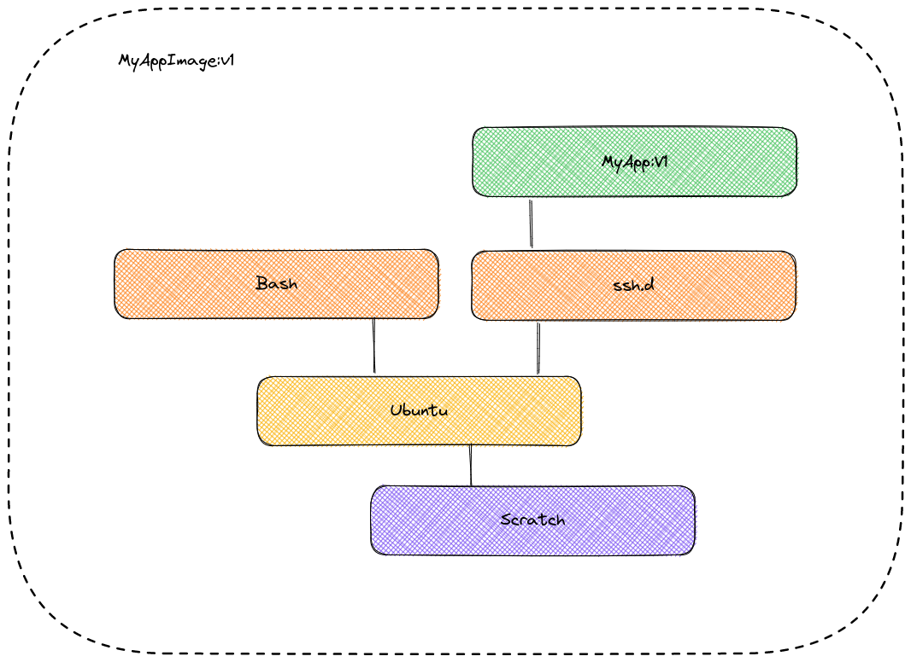

# Scalability

## <mark style="color:purple;">Scalability vs Performance</mark> 

While performance is focused on reducing latency and increasing throughput, scalability aims to have the ability to increase or decrease throughput by adding or removing computational capacity.

## <mark style="color:purple;">Decentralization</mark> 

<figure><figcaption></figcaption></figure>

* Ephemeral disk
* Application server vs assets server
* Centralized cache
* Centralized sessions

The application should be able to be deleted and restarted without any problem, all data should be external.

## <mark style="color:purple;">Scaling database</mark> 

* Increase computational resources
* Disperse responsibility (write “master” vs read “slaves”)
* Sharding
* Serverless

## <mark style="color:purple;">Query and indices optimizations</mark> 

* Work with indices consistently
* APM (Application Performance Monitoring) for queries
* Explain on queries (APM related)
* CQRS

## <mark style="color:purple;">Reverse proxy</mark> 

A reverse proxy is a server that sits in front of one or more web servers, intercepting requests from clients. When clients send requests to the origin server of a website, those requests are intercepted by the reverse proxy server.

The difference between a forward and reverse proxy is subtle but important. A simplified way to sum it up would be to say that a forward proxy sits in front of a client and ensures that no origin server ever communicates directly with that specific client. On the other hand, a reverse proxy sits in front of an origin server and ensures that no client ever communicates directly with that origin server.

<figure><figcaption></figcaption></figure>

Introducing reverse proxy results in increased complexity. A single reverse proxy is a single point of failure, configuring multiple reverse proxies (i.e. a fail over) further increases complexity.

### <mark style="color:green;">**Advantages**</mark> 

Here are some advantages of using a reverse proxy:

* Improved security
* Caching
* SSL encryption
* Load balancing
* Scalability and flexibility

### <mark style="color:green;">Load balancer vs Reverse Proxy</mark> 

Wait, isn't reverse proxy similar to a load balancer? Well, no as a load balancer is useful when we have multiple servers. Often, load balancers route traffic to a set of servers serving the same function, while reverse proxies can be useful even with just one web server or application server. A reverse proxy can also act as a load balancer but not the other way around.

#### <mark style="color:yellow;">Examples</mark> 

Below are some commonly used proxy technologies:

* [Nginx](https://www.nginx.com/)
* [HAProxy](http://www.haproxy.org/)
* [Traefik](https://doc.traefik.io/traefik)
* [Envoy](https://www.envoyproxy.io/)
